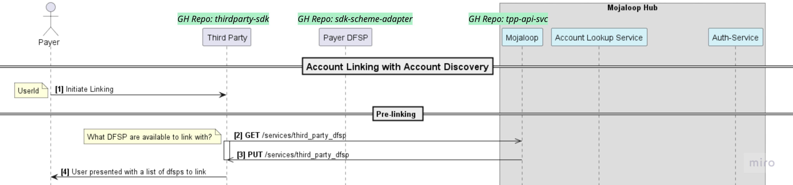

# Technical Onboarding

> _AI disclosure: this document was drafted with assistance from Claude._

An engineering introduction to the Mojaloop **PISP v2.0** workstream — the
repositories you'll work in, where to track work, and how to get set up. 

## 1. GitHub Repositories

The main PISP repositories and their roles:

| Repository | Role |
| --- | --- |
| [`tpp-api-svc`](https://github.com/mojaloop/tpp-api-svc) | PISP v2.0 module on the Mojaloop Switch. Third-party module the hub operator adds to the Mojaloop Hub to enable third-party services. Receives API requests and routes them to the appropriate Mojaloop central hub endpoint. |
| [`thirdparty-api-svc`](https://github.com/mojaloop/thirdparty-api-svc) | PISP v2.0 Third Party SDK. Current implementation focuses on GooglePay; the workstream goal is to generalize it to support broader third parties. |
| [`sdk-scheme-adapter`](https://github.com/mojaloop/sdk-scheme-adapter) | PISP v2.0 DFSP. SDK used by a DFSP to communicate with the Mojaloop Hub. |
| [`pisp-sig-docs/docs`](https://github.com/mojaloop/pisp-sig-docs/tree/main/docs) | PISP v2.0 flow diagrams. |

Shared Mojaloop repositories also used by PISP:

| Repository | Role |
| --- | --- |
| [`api-snippets`](https://github.com/mojaloop/api-snippets) | Shared Mojaloop API definitions/snippets. |
| [`central-services-shared`](https://github.com/mojaloop/central-services-shared) | Mojaloop shared central service. |

### Repository Layout

The example diagram below maps the repositories to the
components they implement in a specific API request flow (in this case, Pre-linking):

| Component (in diagram) | Repository |
| --- | --- |
| Third Party | `thirdparty-sdk` |
| Payer DFSP | `sdk-scheme-adapter` |
| Mojaloop Hub (Mojaloop, Account Lookup Service, Auth-Service) | `tpp-api-svc` |

## 2. Issues and Board

Bookmark these for quick access to PISP V2.0 work:

- [PISP open issues (`oss-pisp` label)](https://github.com/mojaloop/project/issues?q=is%3Aissue%20state%3Aopen%20label%3Aoss-pisp)
- [PISP Workstream Board](https://github.com/orgs/mojaloop/projects/9)
- [Current Milestone](https://github.com/mojaloop/project/milestone/129)

## 3. Setting Up Local Development Tools and Environment

See [Setup Guide](./Setup-Guide.md).
